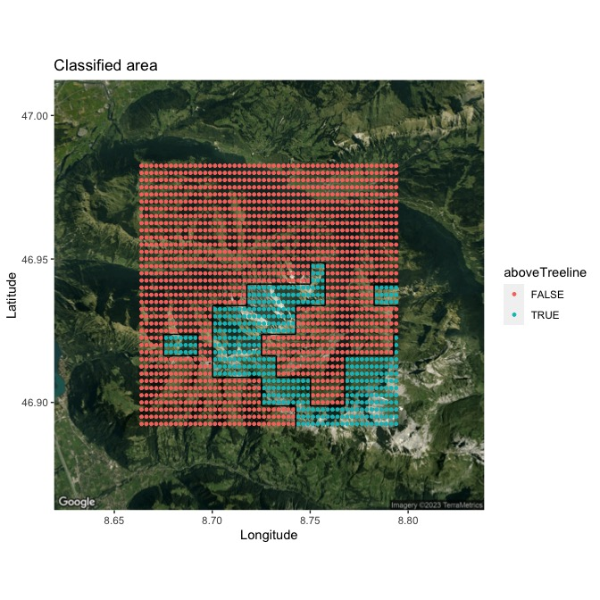
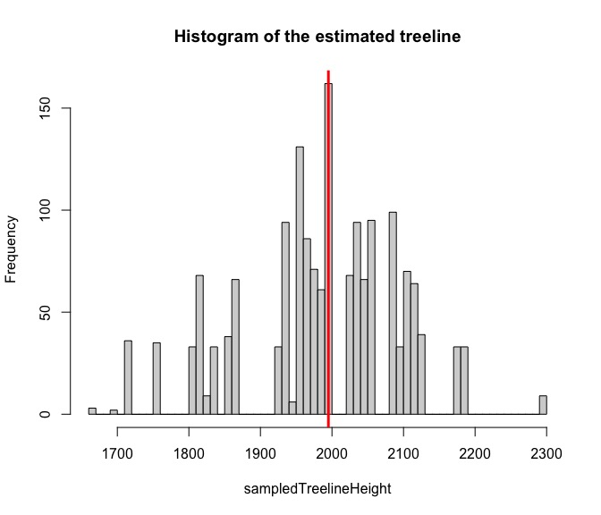

```{r, include = FALSE}
knitr::opts_chunk$set(
  collapse = TRUE,
  comment = "#>"
)
```

```{r, message=FALSE, include = FALSE}
library(ElevDistr)
```

## Getting started

The package ElevDistr can be installed via CRAN or from GitHub using the package [devtools](https://CRAN.R-project.org/package=devtools).\
Stable version from CRAN:

```{r, eval = FALSE}
install.packages("ElevDistr")
library("ElevDistr")
```

Developmental from GitHub:

```{r, eval = FALSE}
install.packages("devtools", repos = "http://cran.us.r-project.org")
devtools::install_github("LivioBaetscher/ElevDistr")
library("ElevDistr")
```

## Process a single data point {#process-a-single-data-point}

Computing the distance to the treeline for a single point is the easiest task. Except for climatic layers and the elevation model, ElevDistr contains everything needed for this task. First of all, it is essential that two climatic raster are imported: one for growing season length (gsl) and one for growing season temperature (gst). I suggest to use the layers from [CHELSA](https://chelsa-climate.org/). The user is free to use different climatic layers, but it is highly recommended to customize the object `pointsAboveTreeline` when using layers other than the CHELSA raster ([see below](#how-to-customize-pointsabovetreeline)). The algorithm does not fail if this adjustment is not made, but it is very likely to have a negative impact on computation time.

```{r}
gstURL <- paste0("https://os.zhdk.cloud.switch.ch/chelsav2/GLOBAL/",
                 "climatologies/1981-2010/bio/CHELSA_gst_1981-2010_V.2.1.tif")
gslURL <- paste0("https://os.zhdk.cloud.switch.ch/chelsav2/GLOBAL/",
                 "climatologies/1981-2010/bio/CHELSA_gsl_1981-2010_V.2.1.tif")

gst <- terra::rast(gstURL, vsi = TRUE)
gsl <- terra::rast(gslURL, vsi = TRUE)
```

Furthermore, a digital elevation model (DEM) needs to be imported. I selected a part of the [GMTED2010](https://www.usgs.gov/coastal-changes-and-impacts/gmted2010) model, which is provided by the U.S. Geological Survey. Importing the layer works the same way as with the climatic raster above.

```{r}
gmted2010URL <- paste0("https://edcintl.cr.usgs.gov/downloads/sciweb1/shared/topo/downloads/GMTED/",
                      "Global_tiles_GMTED/300darcsec/med/E000/30N000E_20101117_gmted_med300.tif")

gmted2010Part <- terra::rast(gmted2010URL, vsi = TRUE)
```

The only thing that needs to be done now is to call the wrapper and specify the longitude, latitude, and elevation of the point of interest.\
Note: All coordinates need to be in World Geodetic System 1984 ('WGS-84').

```{r, eval = FALSE}
distance_to_treeline(lon = 8.65, lat = 46.87,  gstRaster = gst,  gslRaster = gsl, 
                     elevationRaster = gmted2010Part, elevation = 504, pointDf = pointsAboveTreeline, 
                     plot = FALSE, plotHist = FALSE, gstMin = 6.4, gslMin = 94)
```

If using only a few points, the user should plot a map and a histogram of the local treeline height. This can be achieved by changing the default parameters: `plot = TRUE` for the map and `plotHist = TRUE` for the histogram.\
Please note that you need to register a Google API in order to produce a map. A detailed explanation can be found here: [Register a Google API](https://search.r-project.org/CRAN/refmans/ggmap/html/register_google.html). You can check if you have an already registered key with `ggmap::has_google_key()`, and use the command `ggmap::ggmap_show_api_key()` to allow the wrapper to download the map of interest.


```{r eval=FALSE, fig.cap="Example of a sampled area", fig.dim=c(7, 7), message=FALSE, include=FALSE}
#ggmap::ggmap_show_api_key()
point <- as.list(c(8.728898, 46.9375))
temp <- generate_grid(8.728898, 46.93756, 10, 0.0025)
temp$df <- classify_above_treeline(temp$df, gst, gsl)
treeline <- sample_treeline(temp$df, temp$lonLength, temp$latLength, 0.0025)
plot_distr(point, temp$df, treeline, 12)
```

```{r eval=FALSE, fig.cap="Example of treelinie distribution", fig.dim=c(7, 6), message=FALSE, include=FALSE}
point <- as.list(c(8.728898, 46.9375))
temp <- generate_grid(8.728898, 46.93756, 10, 0.0025)
temp$df <- classify_above_treeline(temp$df, gst, gsl)
treeline <- sample_treeline(temp$df, temp$lonLength, temp$latLength, 0.0025)
x <- calculate_distance(treeline = treeline, elevationRaster = gmted2010Part, pointElevation = 512, treelineSampling = 10, plot = TRUE)
```

Furthermore, although it is possible to change the treeline definition by adjusting the thresholds for minimal growing season length and growing season temperature, this option should only be modified if you know what you are doing. Changed thresholds significantly impact the computational output and are carefully selected based on Paulsen and Körner (2014) <https://doi.org/10.1007/s00035-014-0124-0>.

## Process GBIF data

After explaining the basics of the wrapper function `distance_to_treeline`, I will now show an example of how to calculate entire species distribution based on GBIF data. This chapter gives the user an overview of how this R package could be used to process bigger data frames.\
**Remember** that just because this tool is specially designed to handle the uncertainty of spatial data, it does not mean that this approach is a one-size-fits-all solution. Depending on your question you might want to change the approach.

### Download data

First, we need to access GBIF data for processing. As an example, I will download records of two species from GBIF: *Ranunculus pygmaeus* and *Ranunculus thora*. The data can be imported directly from a CSV file or using the package [rgbif](https://CRAN.R-project.org/package=rgbif). Here the fully automatically approach with `rgbif` is demonstrated. However, if you are looking for many data points, you may hit the hard limit of 100,000 occurrences. In such a case downloading the csv file from the [GBIF](https://www.gbif.org) homepage becomes necessary.

```{r}
#install.packages("rgbif") #Remove hashtag if you have not installed this package
myspecies <- c("Ranunculus pygmaeus", "Ranunculus thora")
gbifData <- rgbif::occ_data(scientificName = myspecies, hasCoordinate = TRUE, limit = 20000)
```

To keep the example simple, I will only store the variables of interest: species name, longitude, latitude, elevation and the taxon rank.

```{r}
temp1 <- gbifData$`Ranunculus pygmaeus`$data[, c("scientificName", "decimalLatitude", "decimalLongitude",
                                                 "elevation", "taxonRank")]
temp2 <- gbifData$`Ranunculus thora`$data[, c("scientificName", "decimalLatitude", "decimalLongitude",
                                              "elevation", "taxonRank")]

ranunculus <- rbind(temp1, temp2)
```

### Filter data

Now we are ready to process the downloaded data frame. Here it is only presented how to exclude species with no meaningful elevation. However, depending on your data and your question this very basic filtering might not be sufficient. I recommend to check out the package [CoordinateCleaner](https://CRAN.R-project.org/package=CoordinateCleaner) and think properly of what kind of potential bias you must exclude from your data set.\
Here I exclude all data points that are below 0 meters or above 8,850 meters above the sea level or contain a `NA`. This is achieved using the [Tidyverse](https://CRAN.R-project.org/package=tidyverse) package.

```{r message = FALSE}
#install.packages("tidyverse") #Remove hashtag if you have not installed this package
library("tidyverse")
ranunculusFiltered <- ranunculus %>% filter(!is.na(elevation) & 0 < elevation & elevation < 8850)
```

Furthermore, I will only keep entries that have an assigned taxon of “species”.

```{r}
ranunculusFiltered <- ranunculusFiltered %>% filter(taxonRank == "SPECIES")
```

### Down sampling

To speed up the computation, only 100 random samples are retained. The user might choose a different approach depending on the performed filtering and the desired output accuracy.

```{r}
set.seed(42) #Set a seed for reproducible
ranunculusSampled <- ranunculusFiltered %>% group_by(scientificName) %>% slice_head(n = 100)
```

### Compute distance to the treeline

Now the distance to the closest local treeline can be computed. The computation works similarly to what was explained [above](#process-a-single-data-point) with a single data point, with the difference that vectors for longitude, latitude, and elevation are used as input.

```{r print = FALSE}
#Import climatic layers
gstURL <- paste0("https://os.zhdk.cloud.switch.ch/chelsav2/GLOBAL/",
                 "climatologies/1981-2010/bio/CHELSA_gst_1981-2010_V.2.1.tif")
gslURL <- paste0("https://os.zhdk.cloud.switch.ch/chelsav2/GLOBAL/",
                 "climatologies/1981-2010/bio/CHELSA_gsl_1981-2010_V.2.1.tif")

gst <- terra::rast(gstURL, vsi = TRUE)
gsl <- terra::rast(gslURL, vsi = TRUE)

#Import the DEM
gmted2010URL2 <- paste0("https://edcintl.cr.usgs.gov/downloads/sciweb1/shared/topo/downloads/GMTED/",
                      "Global_tiles_GMTED/300darcsec/med/E000/50N000E_20101117_gmted_med300.tif")

gmted2010Part2 <- terra::rast(gmted2010URL2, vsi = TRUE)

#Run classification for the first five elements
elev <- distance_to_treeline(lon = ranunculusSampled$decimalLongitude[1:5], 
                             lat = ranunculusSampled$decimalLatitude[1:5], gstRaster = gst,
                             gslRaster = gsl, elevationRaster = gmted2010Part2, pointDf = pointsAboveTreeline,
                             elevation = ranunculusSampled$elevation[1:5], plot = FALSE, 
                             plotHist = FALSE, gstMin = 6.4, gslMin = 94)
```

Be aware that the computation time for each point is roughly three seconds, the time increases linear with the amount of input points; $O(n)$. Filtering and parallelization are suitable methods for reducing the computation time.\
The result stored in `elev` are the computed distances to the closest local treeline.

```{r}
elev
```

The function `distance_to_treeline` returns an `NA` if the required number of samples (specified by the input value `treelineSamplingSize`; default value of 10) is not reached, even with an increased search radius, or if the DEM does not cover the area of interest (as is the case in `elev[1]`).

### Increase the speed

The way the three raster are loaded in this tutorial, is not optimized for speed. If you would like to increase the speed it is recommended to download the layers from CHELSA:

-   [gst](https://os.zhdk.cloud.switch.ch/chelsav2/GLOBAL/climatologies/1981-2010/bio/CHELSA_gst_1981-2010_V.2.1.tif)
-   [gsl](https://os.zhdk.cloud.switch.ch/chelsav2/GLOBAL/climatologies/1981-2010/bio/CHELSA_gsl_1981-2010_V.2.1.tif)

and the U.S. Geological Survey:

-   [GMTED2010](https://topotools.cr.usgs.gov/gmted_viewer/viewer.htm) (select the suitable tile and resolution, e.g.: Median - 30 arc-sec)

If a digital elevation model of the whole globe is needed the [GTOPO30.tif](https://drive.google.com/file/d/1qgtMWPVmRCo1-zG21sUM64qgB2U1Cabr/view?usp=sharing) file can be downloaded from my Google Drive. GTOPO30 is also courtesy of the U.S. Geological Survey. All the raster can be imported by customizing:

```{r eval = FALSE}
temp <- terra::rast("your_raster_layer.tif")
```

## How to customize "pointsAboveTreeline" {#how-to-customize-pointsabovetreeline}

As stated in the first paragraph, users can use different climate raster than those presented in the tutorial. However, to keep computation time low, it is recommended to recalculate the `pointsAboveTreeline` data frame.\
After importing the climate raster of your choice, you can use the `generate_point_df` function to identify all points above the treeline.

```{r eval = FALSE}
#Import raster of your choice
gst <- terra::rast(file = "your_gst_layer.tif")
gsl <- terra::rast(file = "your_gsl_layer.tif")

#Compute new data frame
newPointsAboveTreeline <- generate_point_df(gstRaster = gst, gslRaster = gsl, stepSize = 0.0416666, 
                                            gstTreshold = 6.4, gslTreshold = 94)

#Save the output
save(newPointsAboveTreeline, file = "newPointsAboveTreeline.Rdata")
```

The computation takes some time, but it only needs to be executed once.

It is probably relevant to exclude all the points that are that are outside of the mountain polygons [GMBA](https://ilias.unibe.ch/ilias.php?baseClass=ilrepositorygui&cmd=infoScreen&ref_id=1047348). This was done for the `pointsAboveTreeline` data frame. To do so, download the folder from the link above and follow these steps:

```{r eval = FALSE}
#Load the polygons of all the mountains (from the GMBA project)
mountain_polygons <- terra::vect("GMBA mountain inventory V1.2(entire world)/
                                 GMBA Mountain Inventory_v1.2-World.shp")

#Keep only the points that are in a alpine polygon
#"keep" will be a vector containing all row numbers that contain coordinate, which lie in the Alps
keep <- terra::is.related(terra::vect(newPointsAboveTreeline, geom = c("longitude", "latitude")),
                          mountain_polygons, "intersects") |> which() 

newPointsAboveTreeline2 <- newPointsAboveTreeline [keep,] #Pick the lines of interest
```

## How the wrapper works

In case users are interested in how the algorithm works, this paragraph explains what happens behind the scenes. For simplicity, it is explained using the same data as in the first paragraph.\
First, the wrapper searches for the closest point above the treeline in the `pointsAboveTreeline` data frame (or what ever the user feeds into the wrapper). For the search, a k-dimensional tree and a nearest neighbour approach are used by calling the `get_nearest_point` function from the package [RANN](https://CRAN.R-project.org/package=RANN). It is important to find a point close to the treeline because both alpine and non-alpine points are needed in the following steps.

```{r}
pointAbove <- get_nearest_point(lon = 8.65, lat = 46.87, pointDf = pointsAboveTreeline)
pointAbove
```

After getting a point that lies above the treeline, a grid is generated with the extracted point as grid center. The width (in km) and the distance between the points (in degrees) are defined by the input arguments.

```{r}
grid <- generate_grid(lon = pointAbove$lon, lat = pointAbove$lat, squareSize = 10, stepSize = 0.0025)
head(grid$df)
```

Now for each grid point the growing season length and growing season temperature are extracted. Based on the selected input thresholds, it is determined whether the point is above or below the treeline. The extracted information is added to the data frame from the `generate_grid` function output.

```{r}
grid$df <- classify_above_treeline(coords = grid$df, gstRaster = gst, gslRaster = gsl,
                                   gstTreshold = 6.4, gslTreshold = 94)
head(grid$df)
```

Based on this classification, the treeline is drawn, if two points with a different classification lie next to each other, a vertical or horizontal line is drawn between the points and `NA` values are ignored. The lines are stored in a data frame with the following information: an identifier, a start latitude and longitude, and an end latitude and longitude.

```{r}
treelineDf <- sample_treeline(df = grid$df, lonLength = grid$lonLength, latLength = grid$latLength)
head(treelineDf)
```

After this step, the wrapper contains a safety feature: whenever there are fewer than ten treeline elements, the last three functions are recalculated with a bigger grid (+5 km). It is implemented in case only a few trellises are found, which indicates potential problems and might increase uncertainty.\
After this safety loop the `plot` argument is evaluated. If it is `= TRUE` a map is generated by calling the function `plot_distr`.

```{r eval = FALSE}
plot_distr(nearestCorner = pointAbove, grid = grid$df, treelineDf = treelineDf, size = 12)
```

In the final step, the treeline is sampled with a step size defined in the input argument. From all the drawn points, the elevation is extracted from the `elevationRaster` (containing a digital elevation model). Of all extracted elevations, the median is calculated and subtracted from the `pointElevation` input to estimate the relative distance to the local treeline. This function is capable of plotting a histogram of the extracted elevation points, including the median.

```{r}
calculate_distance(treeline = treelineDf, elevationRaster = gmted2010Part, pointElevation = 504,
                   treelineSampling = 10, plot = FALSE)
```

If desired, all the functions can be called independently of the wrapper.
